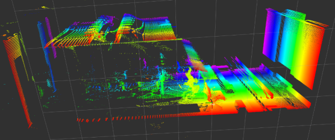

# 3D RAIL RECONSTRUCTION

### run
```
$ rosbag record /scan
$ rosrun tf static_transform_publisher 0 0.94 0 0 0 0 odom laser_link 100
$ rosrun visualization visualization
$ rosbag play bag
```
find laser_guide_rail_rebuild.pcd

### example
